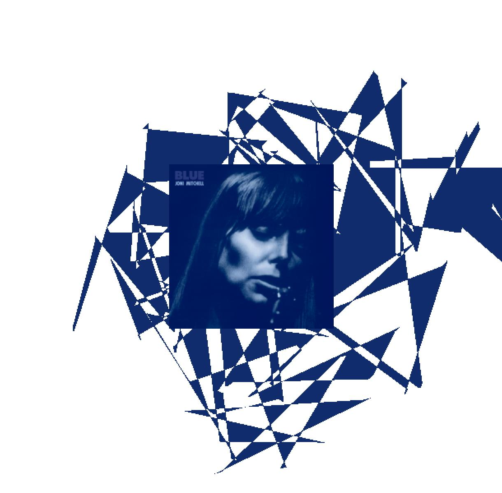
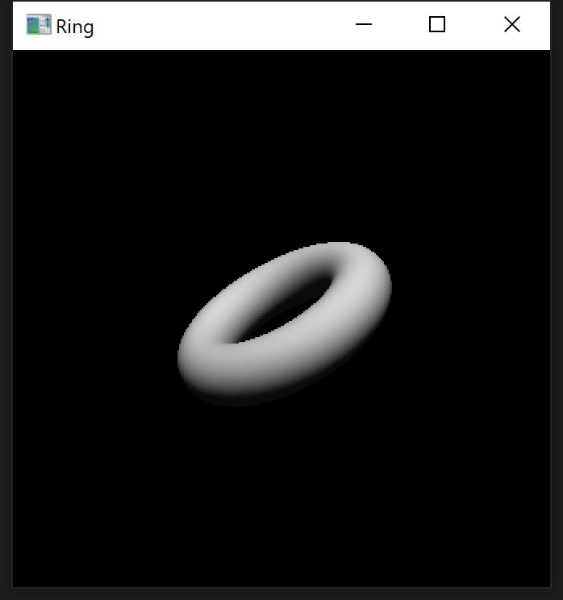

# Computer Graphics Projects
Course Projects, Computer Graphics, Fudan University, Fall 2021  
by 傅尔正 18307130163  

GitHub项目地址: https://github.com/codeplay0314/PJ-Computer-Graphics-Fudan-Fall-2021

## 1 Music Visualization

### 代码结构
`run.py` 主程序  
`music.conf` 配置文件，存放音乐文件目录
`data/` 存放音乐文件以及封面
`module` 存放依赖来源文件
```
1-MUSIC-VISUALIZATION
│   run.py
│
├───config
│       music.conf
│
├───data
│       Blue - Album Cover.jpg
│       Joni Mitchell - Little Green.mp3
│
├───module
│   │   AudioAnalyzer.py
│   │
│   └───__pycache__
│           AudioAnalyzer.cpython-39.pyc
│
└───__pycache__
        AudioAnalyzer.cpython-39.pyc
```

### 代码解释
主程序中输入文件分别为音频文件和封面，首先依赖 `module.AudioAnalyzer.py` 对音频文件进行分频段解析，共分为低频段（30\~150Hz）、中低频段（150\~500Hz）、中高频段（500\~5000Hz），对一定时间内每个频段内进行等距切分，取音量平均值作为参量。  
这里利用 `pygame` 库进行实时绘制，首先在屏幕中央封面，再取封面像素的平均rbg作为主题色，对于上述切分的音频段，每段围绕封面边缘正方形周围绘制三角形，并随机添加旋转角度，叠加抵消。

### 运行命令
```bash
 python 1-Music-Visualization/run.py 1-Music-Visualization/config/music.conf
 ```

 ### 运行效果
  

 视频见 `data/videos/1.mp4`

 ## 2 Realistic Rendering

### 代码解释
通过PyOpenGL库绘制圆形戒指，详情见代码注释。

### 运行命令

```bash
 python ./2-Realistic-Rendering/run.py
 ```

 ### 运行效果

  
## 